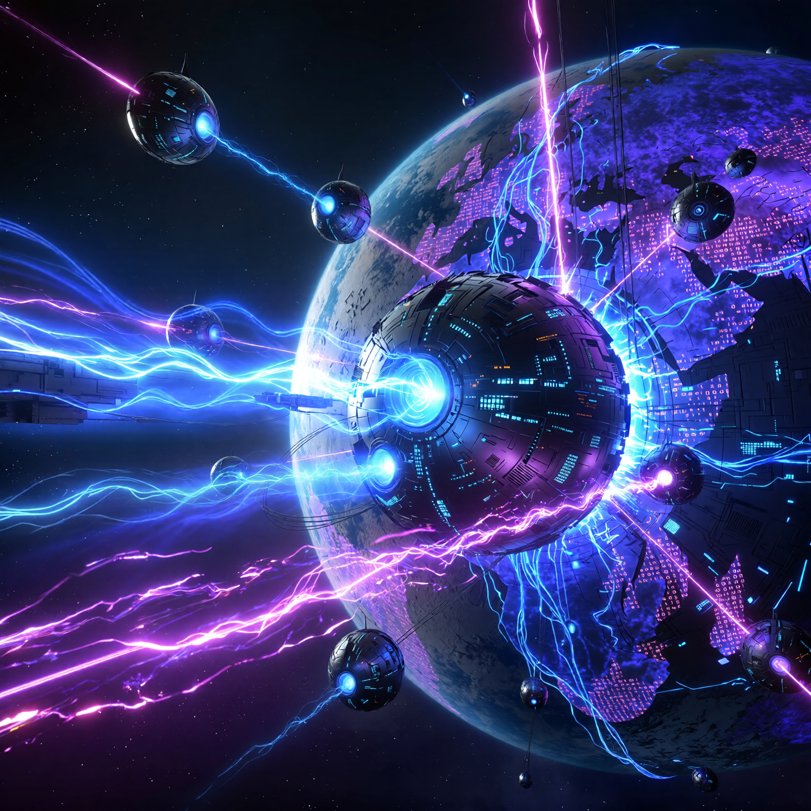

# 🚀 Portfolio 2026: The Dual-Theme Experience

An advanced, immersive portfolio exploring the duality between **Professional Excellence** and **Creative Innovation**. Built with Next.js and React, this project represents the convergence of high-performance web development and cinematic user experiences.



## 🌌 The Concept: Dual Themes
This portfolio is not just a resume; it's a journey.
- **Standard Mode**: A clean, accessible, and high-performance interface for professional overview.
- **Space Void (The Creative Core)**: An interactive 3D experience where skills orbit like planets and projects drift in a digital cosmos. This theme showcases mastery in **WebGL**, **Three.js**, and **Creative Coding**.

## 🛠️ Tech Stack & Architecture
- **Core**: [Next.js](https://nextjs.org/) (App Directory), React, TypeScript
- **Styling**: TailwindCSS, CSS Modules, Glassmorphism aesthetics
- **Animation**: GSAP (GreenSock), Three.js / React Three Fiber
- **State Management**: React Hooks & Context
- **Deployment**: Vercel

## ✨ Key Features
- **Dynamic Preloader**: "System Online" cinematic initialization sequence.
- **Interactive Orbit System**: Skills and certs visualized as celestial bodies.
- **EmailJS Integration**: Fully functional contact forms with instant feedback.
- **Optimized Assets**: High-res video backgrounds and WebP image compression.
- **Responsive Design**: Fluid layouts that adapt from mobile to ultra-wide screens.

## 🚀 Getting Started

First, install dependencies:
```bash
npm install
# or
yarn install
```

Run the development server:
```bash
npm run dev
```

Open [http://localhost:3000](http://localhost:3000) with your browser into the void.

---
*Created by [Astha Singh] - Web Developer & AI Enthusiast*
